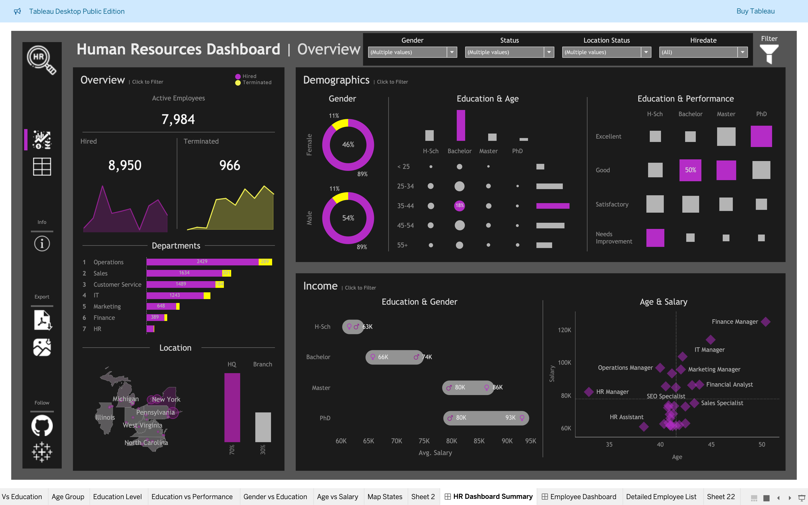

# 📊 HR Analytics Dashboard (Tableau Project)

This project showcases my ability to translate a business-oriented HR use case into a visually compelling, interactive Tableau dashboard. The goal was to build a complete HR analytics solution with executive-level summaries and drill-down capabilities.

---

## 🧩 Project Structure

The dashboard is divided into four major analytical zones:

---

## 1️⃣ Overview

Gives a quick snapshot of the organization’s workforce health.

### Key Insights:
- Total Hired: **8,950**
- Active Employees: **7,984**
- Terminated: **966**

Includes:
- **Year-wise Hiring & Termination Trends**
- **Departmental & Job Title Breakdown**
- **Location Split: HQ vs Branch (70% vs 30%)**

## 2️⃣ Demographics

Breaks down workforce composition by key demographic variables.

### Highlights:
- **Gender Ratio**: Clear male/female distribution with % labels
- **Age Grouping**: Logical bins like `<25`, `25–34`, etc.
- **Education Levels**: Analyzed independently and in combination with performance scores

---

## 3️⃣ Income Analysis

Uncovers trends and disparities in employee compensation.

### Visual Comparisons:
- **Salary by Education Level & Gender**  
- **Salary by Age within Each Department**
- **Performance Ratings vs Education (Bubble Chart)**

---

📸 *Dashboard Visual*  

## 4️⃣ Interactive Employee Records

A searchable, filterable employee directory to deep-dive into individual profiles.

### Table Columns Include:
- Employee ID, Name, Age, Gender, Education
- Job Title, Department, City, State
- Salary, Status, Hire Date, Termination Date, Length of Hire

Includes **filters for**:
- Gender
- Employment Status
- Location (HQ/Branch)
- Hiring Year, and more

📸 *Employee Table View*  

---

## 🎨 Mockup Design

Before building the dashboard, I created layout mockups using draw.io to structure my thinking and ensure visual hierarchy.

📸 *Wireframe / Layout Sketch*  

---

## 🔗 View Dashboard Live

👉 [Click here to explore the interactive dashboard on Tableau Public](https://public.tableau.com/app/profile/yourname)

---

